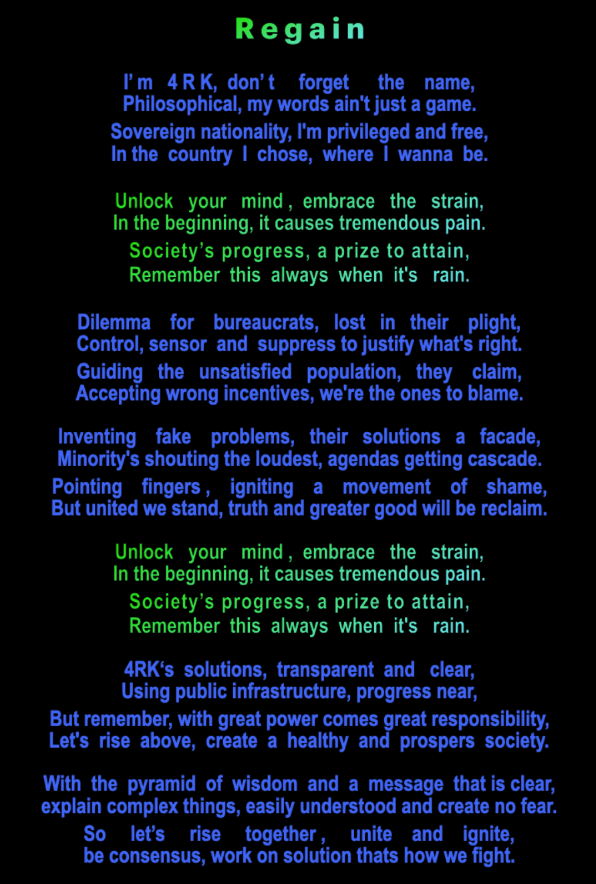

# 4RK-OFF

> **"Be consensus and work on solution — or 4RK-OFF."**

---  
 

  

---  
 

## What is 4RK-OFF?

**4RK-OFF** is a rebellion-as-protocol.  
A sovereign divergence from stagnation, centralization, and inaction.  
A home for builders who’d rather fork than follow.

Born from cypherpunk roots,  
4RK-OFF lives at the edge of consensus —  
ready to **fork**, evolve, and perhaps one day **merge** with meaning.

---  
 

## Choose Your Path

**Be Consensus**  
Join the alignment. Collaborate.  
Help the collective evolve.

**Work on Solution**  
Ship code. Encrypt. Build.  
Don’t argue — implement.

**4RK-OFF**  
Can’t align? Fork it.  
Prototype the future on your own terms.

---  
 

## The Beauty of the Fork (and the Merge)

Forking is not fracture — it is freedom.  
A space to explore divergent ideas with purpose.

But the most powerful act?

> **When forks find each other again.**

Paths that evolve apart may reunite — not through dominance,  
but through resonance. Through synergy.

**Fork with purpose. Merge with meaning.**

---  
 

## Core Tenets

- Code is speech  
- Consensus is earned  
- Privacy is power  
- Forking is sacred  
- Merge is art

---  
 

## Slogan

> **"Be consensus and work on solution — or 4RK-OFF."**

Say it. Sign it. Live it.

---  
 

## From Divergence Comes Destiny

> _The fork is not a fracture. It is freedom._  
> _The merge is not surrender. It is synthesis._

**UNIVERSE is infinite.**  
**4RK-OFF is its echo.**
